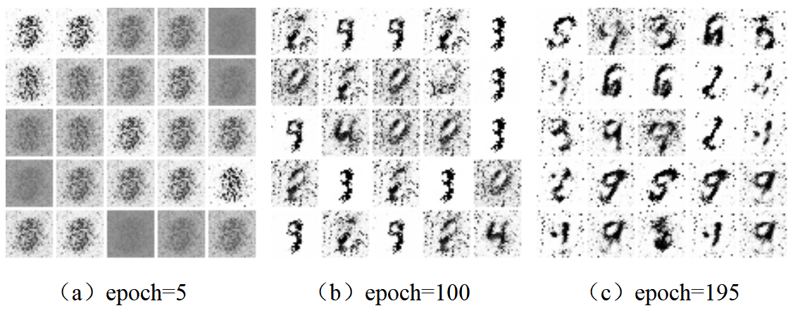
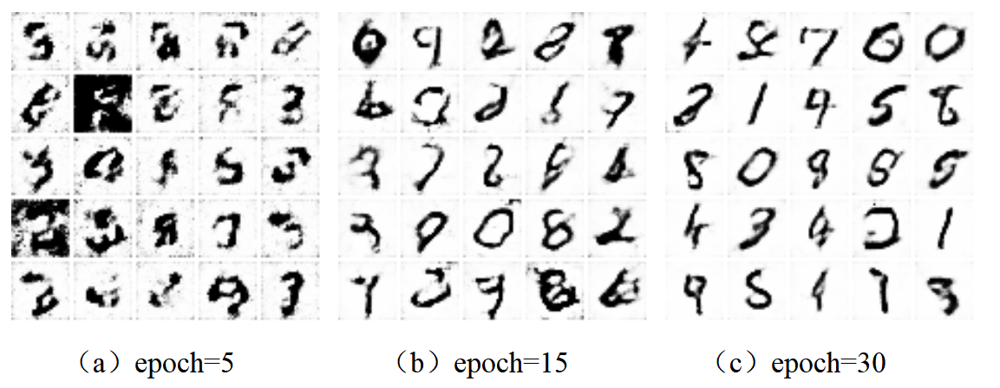

## 说明

	此为《人工智能入门实践》（肖波等著）6.5节代码，训练对抗生成网络（GAN），生成手写数字识别。
	
	（1）main.py: 对应教材6.5.2节的代码。
	生成器网络和鉴别器网络未使用CNN，基本都是线性层+批标准化层+激活函数层
	训练过程中，会在imgs目录中，每间隔5次迭代，得到一部分生成的数字图像，便于观察生成效果。
	
	（2）main_CNN.py: 对应教材6.5.3节的代码。
	生成器网络和鉴别器网络使用了CNN。损失函数等也进行了改进。
	生成效果相对于前者较好。

## 执行程序前，安装必要的包：

  pip install -r requirements.txt
 
## 直接看示例：
	main.py结果

	main_CNN.py结果

	
